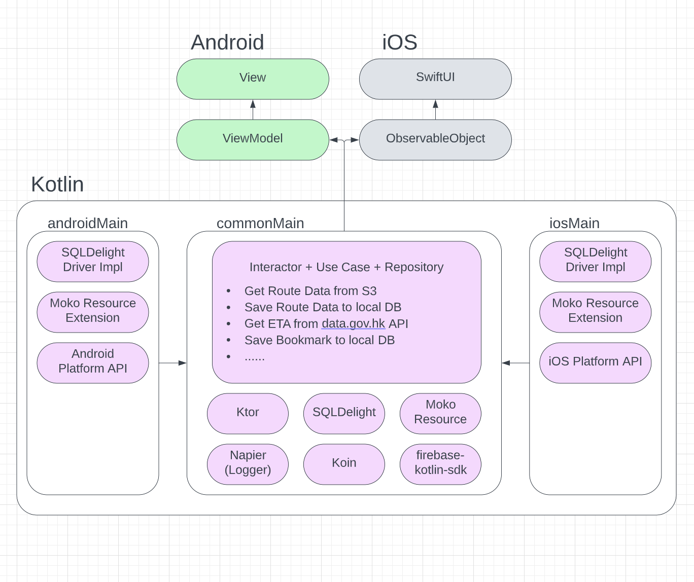

# TBIA (The Bus Is Arriving)

TBIA provides the real-time schedule (ETA) for KMB, NWFB/CityBus, NLB and minibus, as well as MTR
and Light rail transit.

## About

Transportation data is from DATA.GOV.HK at first, and processed via Firebase Cloud Function API.

Ads banner is included in app, however you can disable it for a while in Settings page.

Feel free to contribute with pull requests to this project if you have any specific improvements in
mind.

Google Play Store link: https://play.google.com/store/apps/details?id=hibernate.v2.tbia

Apple App Store link: TBA

## TODO

- Support MTR and Light rail transit in iOS
- Support Google Maps in iOS

## Architecture

This is the code repository for TBIA. I originally built it as Android mobile and Android TV app,
and thanks to Kotlin Multiplatform Mobile (KMM) that helps developers share code between Android and
iOS in a flexible way, it allows me to port the app in iOS within a month.

The project contains both Android and iOS modules for view, with a single
codebase for networking, data storage, analytics, and the other logic in Kotlin.

Kotlin Multiplatform Mobile KMM

- Sqldelight - Local Database
- Ktor - HTTP Client
- Koin - Dependency Injection
- Napier - Logging
- Moko Resource - System resources manager (String, Color, Image)
- firebase-kotlin-sdk - A Kotlin-first SDK for Firebase
- kotlinx-datetime - Date & Time